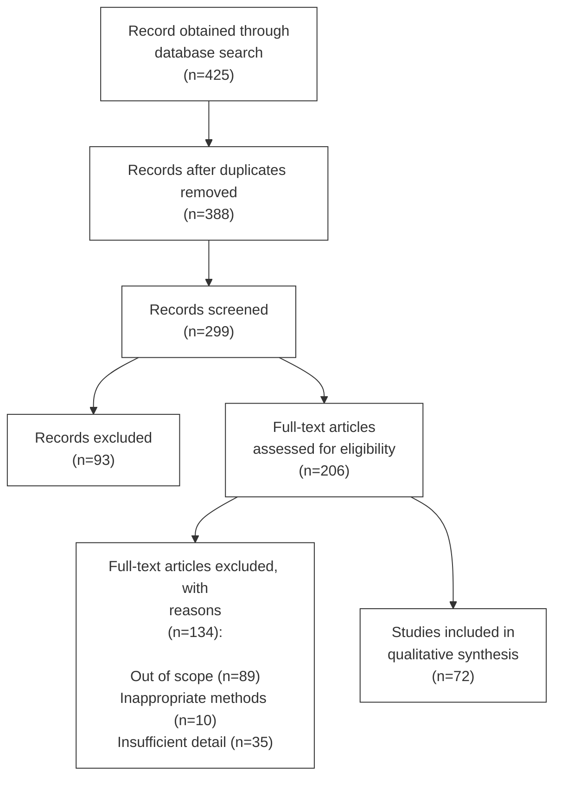

### Project Info

2023 Oct – 2024 April, Undergraduate Research Society at University of South Florida 


🔬 Team | Maribel Serracin, Giang Ha, Chelsea Gabarron, Maria Hanna, Maddie Jarzabek, Archana Rao, Lauren Song, Gayathri Mannem

---

*Published on: April 1, 2025*

### Overview

<div style="display: flex; justify-content: space-around;">
    
</div>

Welcome to my first research project! This post documents our exploration of telehealth's effectiveness in reaching underserved populations. This is an interactive research blog where I encourage readers to contribute their thoughts and insights about telehealth experiences.


### Introduction

The COVID-19 pandemic dramatically changed the landscape of healthcare delivery worldwide, fostering the expansion of telehealth. My interest in this topic was sparked during the pandemic when telehealth utilization surged as an adaptation to the challenges of providing continuous healthcare amidst restrictions on physical mobility and social distancing.

The field of telehealth has seen significant developments in recent years, particularly in expanding access to medical care. This project aims to assess the global impact and effectiveness of telehealth practices, especially for people who cannot access in-person healthcare due to reasons including but not limited to scarcity of nearby medical centers, lack of transportation, and lack of finances.

### Research Question

This project seeks to address the following question:

> What is the potential role and effectiveness of telehealth for healthcare-deprived or low-resource communities globally?

Additional questions explored include:
- How has telehealth improved healthcare accessibility and quality, especially for underserved populations?
- What disparities persist in telehealth implementation, and what barriers prevent equal access?
- How can telehealth be optimized to close healthcare gaps between urban and rural patients?

### Methodology

#### Data Collection

Articles discussing the effects of telehealth on healthcare-deprived or low-resource communities were collected and accessed through Rayyan. We conducted a systematic review of experimental and review articles to determine the global impact and effectiveness of telehealth practices.

#### Analysis Approach

We performed a systematic filtering through various study methods and variables to determine relevancy to our research topic. Our analysis evaluated telehealth's role in enhancing accessibility, quality of care, and its potential in mitigating healthcare disparities.

## example 1
Let me create a Markdown representation of your PRISMA flow diagram for your systematic review. I'll use Markdown's capabilities to represent the boxes and arrows as best as possible.



If you prefer to have this in regular Markdown code that you can directly copy and paste (without using Mermaid), here's an alternative using text-based diagrams:

```markdown
## PRISMA Flow Diagram

```
┌───────────────────────────────┐
│    Record obtained through    │
│        database search        │
│           (n=425)            │
└─────────────┬─────────────────┘
              ▼
┌───────────────────────────────┐
│  Records after duplicates     │
│        removed (n=388)        │
└─────────────┬─────────────────┘
              ▼
┌───────────────────────────────┐     ┌───────────────────────┐
│      Records screened         │────▶│   Records excluded    │
│          (n=299)             │     │       (n=93)         │
└─────────────┬─────────────────┘     └───────────────────────┘
              ▼
┌───────────────────────────────┐     ┌───────────────────────────────┐
│      Full-text articles       │     │ Full-text articles excluded,  │
│    assessed for eligibility   │────▶│       with reasons            │
│          (n=206)             │     │         (n=134):              │
└─────────────┬─────────────────┘     │                               │
              │                       │    Out of scope (n=89)        │
              │                       │ Inappropriate methods (n=10)  │
              │                       │  Insufficient detail (n=35)   │
              │                       └───────────────────────────────┘
              ▼
┌───────────────────────────────┐
│      Studies included in      │
│     qualitative synthesis     │
│           (n=72)             │
└───────────────────────────────┘
```

You can also use HTML tables in your Markdown to create a more structured representation:

```markdown
## PRISMA Flow Diagram

<table>
<tr>
<td style="background-color:#2F5233; color:white; text-align:center; padding:10px;">Identification</td>
<td>
<div style="border:1px solid black; padding:10px; text-align:center; margin:10px;">
Record obtained through database search<br>(n=425)
<div style="text-align:center;">↓</div>
</div>
</td>
</tr>
<tr>
<td style="background-color:#2F5233; color:white; text-align:center; padding:10px;">Screening</td>
<td>
<div style="border:1px solid black; padding:10px; text-align:center; margin:10px;">
Records after duplicates removed<br>(n=388)
<div style="text-align:center;">↓</div>
</div>
<div style="border:1px solid black; padding:10px; text-align:center; margin:10px;">
Records screened<br>(n=299)
<div style="text-align:center;">↓</div>
</div>
<div style="display:flex; justify-content:space-between;">
<div style="text-align:center;">↓</div>
<div style="border:1px solid black; padding:10px; text-align:center; margin:10px; width:40%;">
Records excluded<br>(n=93)
</div>
</div>
</td>
</tr>
<tr>
<td style="background-color:#2F5233; color:white; text-align:center; padding:10px;">Eligibility</td>
<td>
<div style="border:1px solid black; padding:10px; text-align:center; margin:10px;">
Full-text articles assessed for eligibility<br>(n=206)
<div style="text-align:center;">↓</div>
</div>
<div style="display:flex; justify-content:space-between;">
<div style="text-align:center;">↓</div>
<div style="border:1px solid black; padding:10px; text-align:center; margin:10px; width:60%;">
Full-text articles excluded, with reasons<br>(n=134):<br><br>
Out of scope (n=89)<br>
Inappropriate methods (n=10)<br>
Insufficient detail (n=35)
</div>
</div>
</td>
</tr>
<tr>
<td style="background-color:#2F5233; color:white; text-align:center; padding:10px;">Included</td>
<td>
<div style="border:1px solid black; padding:10px; text-align:center; margin:10px;">
Studies included in qualitative synthesis<br>(n=72)
</div>
</td>
</tr>
</table>
```

The Mermaid diagram is the best option if your GitHub blog supports it, as it will render the flow chart nicely. If not, either the text-based diagram or the HTML table approach should give you a good representation of your PRISMA flow diagram.

### Findings

Here are the key findings from our research:

1. **Improved Accessibility**: Telehealth has greatly improved accessibility to care by promoting remote healthcare and facilitating easy access to information through e-record systems.
   

2. **Quality of Care**: Telehealth has made improvements in quality of care for underserved populations and is helping close the healthcare gap between urban and rural patients.
   

3. **Specialized Benefits**: Telehealth has been particularly beneficial in areas such as remote screening, chronic condition management, addressing acute medical emergencies, and pediatric care.

4. **Persistent Disparities**: While telehealth can close mobility and transportation gaps, disparities due to insufficient internet, lack of access to devices, and language barriers continue to persist.

### Discussion

Our research underscores the positive impacts of telehealth utilization within communities, especially those catering to healthcare-deprived or low-resource demographics. Telehealth initiatives have demonstrated significant strides in extending their scholarly approach to vital constituents, including lower-income communities, the elderly, and regions within developing nations.

#### Limitations

It's important to acknowledge some limitations of this research:
- Economic barriers remain significant, as the costs of essential telehealth equipment pose a challenge
- Our study focused primarily on English-language publications, potentially missing insights from non-English sources
- Long-term effectiveness data is still emerging as telehealth adoption continues to evolve

#### Future Directions

Based on what we've learned, here are some promising directions for future research:
- Exploring training programs for healthcare professionals to better utilize telehealth technologies
- Investigating how to close telehealth-related barriers for certain demographics such as older adults and racial and ethnic minorities
- Developing low-cost telehealth solutions for implementation in extremely resource-limited settings

### Interactive Section

This is where you come in! I'd love to hear your thoughts and contributions.

#### Discussion Questions

1. Have you personally used telehealth services? How did they compare to in-person healthcare in your experience?
2. What barriers to telehealth adoption have you observed in your community?
3. How might telehealth be better adapted to serve elderly populations or those with limited technical literacy?

#### Contribute Your Data

If you'd like to contribute to this ongoing research, consider sharing your own telehealth experiences:

1. Fork this repository
2. Add your experience to the `contributions` folder following the template
3. Submit a pull request
4. I'll incorporate valid contributions into future analysis

#### Poll

<details>
<summary>What do you believe is the biggest barrier to telehealth adoption?</summary>

- [ ] Internet access
- [ ] Device availability (computers, smartphones)
- [ ] Technical literacy
- [ ] Cost of equipment
- [ ] Language barriers
- [ ] Privacy concerns
- [ ] Other (please specify in comments)

(Note: GitHub markdown doesn't support actual polls, but readers can comment with their choice)
</details>

### References

1. [Multiple studies as shown in the research poster's Results section]
2. [Additional references from the systematic review]

---

### Comments

Leave your thoughts, questions, or suggestions in the comments section below. I try to respond to all thoughtful engagement!

*Research conducted by: Maribel Serracin, Giang Ha, Chelsea Gabarron, Maria Hanna, Maddie Jarzabek, Archana Rao, Lauren Song, Gayathri Mannem*  
*University of South Florida*  
*Last updated: April 1, 2025*
